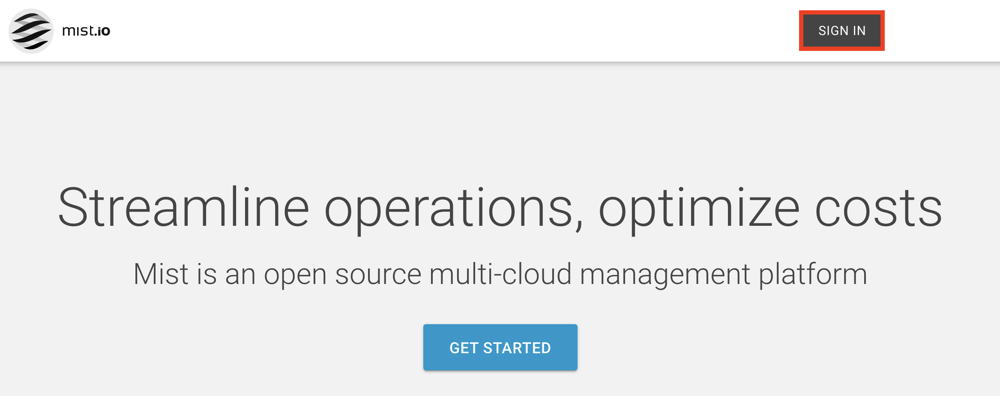

## Mist.io Marketplace App

[Mist.io](https://mist.io/) is an open-source multi-cloud management platform that can help users to control their cloud infrastructure across a number of different sources.

## Deploy Mist.io with Marketplace Apps



### Mist.io Options

| **Field** | **Description** |
|:--------------|:------------|
| **Mist admin user's email** | The e-mail address of the administrator. Used as a log-in credential similar to a username. *Required* |
| **Mist admin user's password** | The password of the Mist.io administrator account. *Required* |

### Linode Options

After providing the app-specific options, provide configurations for your Linode server:

| **Configuration** | **Description** |
|-------------------|-----------------|
| **Select an Image** | Debian 9 and Debian 10 are currently the only images supported by the Mist.io Marketplace App, and are pre-selected on the Linode creation page. *Required* |
| **Region** | The region where you would like your Linode to reside. In general, it's best to choose a location that's closest to you. For more information on choosing a DC, review the [How to Choose a Data Center](/docs/platform/how-to-choose-a-data-center) guide. You can also generate [MTR reports](/docs/networking/diagnostics/diagnosing-network-issues-with-mtr/) for a deeper look at the network routes between you and each of our data centers. *Required*. |
| **Linode Plan** | Your Linode's [hardware resources](/docs/platform/how-to-choose-a-linode-plan/#hardware-resource-definitions). An 8GB Linode is recommended for your Mist.io App. The Linode plan that you select should be appropriate for the amount of data transfer, users, storage, and other stress that may affect the performance of server.  *Required* |
| **Linode Label** | The name for your Linode, which must be unique between all of the Linodes on your account. This name will be how you identify your server in the Cloud Manager’s Dashboard. *Required*. |
| **Root Password** | The primary administrative password for your Linode instance. This password must be provided when you log in to your Linode via SSH. The password must meet the complexity strength validation requirements for a strong password. Your root password can be used to perform any action on your server, so make it long, complex, and unique. *Required* |

When you've provided all required Linode Options, click on the **Create** button. **Your Mist.io app will complete installation anywhere between 5-15 minutes after your Linode has finished provisioning**.

## Getting Started After Deployment

Once the Mist.io server is successfully created, a few additional steps must be completed to be able to begin using the application.

### Log In to Mist.io

1. In a web browser, enter your Linode's [IP address](docs/guides/find-your-linodes-ip-address/) or the [Domain](docs/guides/dns-manager/) associated with it to access your Mist.io App's login screen.

1. Click on the **Sign in** button at the top right of the page.

    

1. Enter your Mist admin `Email Address` and `Password` in their respective fields to complete the log-in process.

    

### Next Steps

After creating your account, create a name for your organization, [Add Clouds](https://docs.mist.io/category/75-adding-clouds-bare-metal-and-containers) to manage, as well as any separate [virtual machines, containers,](https://docs.mist.io/category/158-machines) and more.

For more available configuration options, check out the Mist [Github repo](https://github.com/mistio/mist-ce#configuring).
