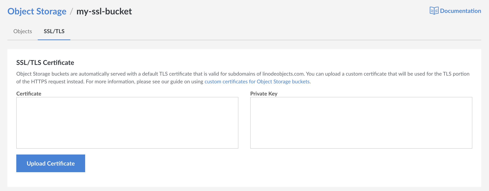

---
author:
  name: Linode
  email: docs@linode.com
description: "Learn how to upload a custom SSL/TLS certificate to enable SSL on a bucket on Linode Object Storage."
og_description: "Learn how to upload a custom SSL/TLS certificate to enable SSL on a bucket on Linode Object Storage."
keywords: ['object','storage','object storage','s3','bucket']
tags: ["linode platform","cloud manager"]
license: '[CC BY-ND 4.0](https://creativecommons.org/licenses/by-nd/4.0)'
published: 2020-10-06
modified: 2020-10-06
modified_by:
  name: Linode
title: "Upload a Custom SSL/TLS Certificate on Object Storage"
h1_title: "Uploading a Custom SSL/TLS Certificate on Object Storage"
contributor:
  name: Linode
external_resources:
- '[S3cmd usage and command reference](https://s3tools.org/usage)'
aliases: ['/platform/object-storage/enable-ssl-for-object-storage/']
---

By default, Linode's Object Storage uses a default TLS certificate for subdomains of `linodeobjects.com` to encrypt data in transit. In some cases however, it may be more desirable to use your own custom SSL certificate.

Object storage supports the importing of your own [TLS/SSL Certificates](https://www.linode.com/docs/security/ssl/) in order to encrypt connections with your bucket in transit. Currently, you can Upload custom TLS/SSL certificates directly through the Linode Manager, the [Linode CLI](https://www.linode.com/docs/platform/api/linode-cli/), and the [Linode API](https://developers.linode.com/api/v4/object-storage-buckets-cluster-id-bucket-ssl).

In this guide, you will learn how to add your own SSL Certificates and Private Keys to Object Storage buckets.

## Before you Begin

- [Purchase or Create an SSL certificate](https://www.linode.com/docs/security/ssl/) for a domain you'd like to use to point to your object storage bucket. This certificate must share a common name, SAN, or wildcard SAN which is capable of matching the FQDN of the bucket that will be created in a later step.

## Create an Object Storage Bucket

All Object Storage Buckets using an SSL certificate created by a user **must match a Fully Qualified Domain Name under the user's control**. For example, if you will be using an SSL certificate for `test.example.com`, the bucket name should also be `test.example.com` Otherwise, this process is the same as the creation of any other bucket.



## Configure DNS

It is recommended that CNAME records are used in order to give you control of the domains that will require the use of custom SSL certificates. For example, to enable an SSL certificate for the bucket `test.example.com` hosting a static site in the `us-east-1.linodeobjects.com` cluster location, you would point the CNAME record to `test.example.com.website-us-east-1.linodeobjects.com`. For more information on DNS records and CNAME records, see our [Introduction to DNS Records](https://www.linode.com/docs/networking/dns/dns-records-an-introduction/#cname) guide.

## Upload Your SSL Certificate

To upload your new SSL certificate to an Object Storage Bucket:

1. If you have not already, log into the Linode Cloud Manager.

1. Click the Object Storage link in the sidebar, followed by the Bucket you'd like to add your SSL certificate to.

1. Near the top of the following page, select the `SSL/TLS` tab to open the SSL configuration menu.

    

1. In the `Certificate` field, enter the contents of the certificate file affiliated with the SSL certificate. In the `Private Key` field, enter the contents of the private key file affiliated with the SSL certificate.

1. Once both fields have been filled out with the requested information, click on the `Upload Certificate` button to complete the upload of your SSL certificate.

Once all steps are completed, your personal SSL certificate will now be used in place of the certificate provided by default.