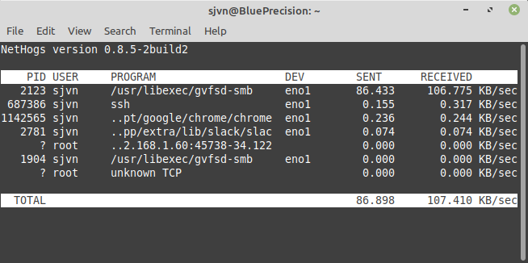
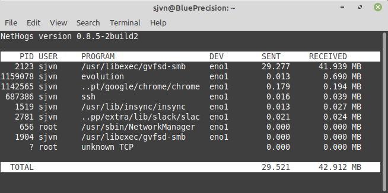

[Nethogs](https://github.com/raboof/nethogs) is a free, open-source program used to track network usage. It extends the net top tool to track bandwidth by process. For example, `net top` may show that outbound traffic increased on a Linux server by protocol or subnet. But nethogs makes it easier for Linux administrators to identify which process is generating the usage spikes.

Nethogs gathers its data from the files within the `/proc/net` directories. It does not rely on a special kernel module or driver. It works on any Linux system, but it doesn't work well on other related server operating systems such as [FreeBSD](https://www.freebsd.org/).

Using the collected data, nethogs displays both `process IDs` (`PID`) and the program's name. This makes it easy to identify which programs may be misbehaving, because you can see the programs that are using more than their fair share of available bandwidth.

When the Linux networking monitoring tool is started, nethogs displays current networking data. It picks up this data by using both `proc` data and [`libpcap`](https://man7.org/linux/man-pages/man3/libcap.3.html) for user-level packet capture. Nethogs then displays the data as a text-based chart, using [ncurses](https://linux.die.net/man/3/ncurses). As long as you have the program running in the foreground, the nethogs display is constantly updated.

## Before You Begin

If you are using a Linode, make sure you run the steps in this section to configure your Linode, secure your server, and update your system's packages.

1.  Familiarize yourself with our [Getting Started](/docs/getting-started/) guide and complete the steps for setting your Linode's hostname and timezone.

1.  This guide uses `sudo` wherever possible. Complete the sections of our [Securing Your Server](/docs/security/securing-your-server/) guide to create a standard user account, harden SSH access and remove unnecessary network services.

1.  Update your system:

        sudo apt update && sudo apt upgrade

## Installing nethogs

Many Linux distributions come with nethogs already installed. However, if that is not the case, this section shows you how to install nethogs on a Debian or Ubuntu distribution.

1. Install nethogs:

        sudo apt-get install nethogs

## Common Nethogs Commands

Nethogs is commonly run as an interactive program. But it also can be used in shell programs, or as a graphical program with the [nethogs-qt](http://slist.lilotux.net/linux/nethogs-qt/index_en.html) Qt-based GUI.

The nethogs Linux networking system monitoring program's syntax is as follows:

        nethogs [option] [port name]

Nethogs defaults to constantly measuring traffic to and from the `eth0` port when the utility is run without any options:

        sudo nethogs

In the example below, nethogs reports an Ubuntu Linux workstation copying a Server Message Block (SMB) file from a Samba server, the Chrome web browser, a background Slack messaging client, and an idle Evolution e-mail client.

Use the `-d` flag to instruct nethogs to use a refresh rate. This is measured in seconds. For example, to refresh the display every five seconds:

        sudo nethogs -d 5

To add a refresh rate of five seconds and device name to monitor the `eno1` device bandwidth use the command:

        sudo nethogs -d 5 eno1

Nethogs can also be used to monitor multiple network ports at once. For instance, to collect data from `eth0` and `eth1` ports:

        sudo nethogs -d 5 eth0 eth1

### Control nethogs Interactively

While nethogs is running you can use the following interactive commands:

- **`-m`**: Change the units that are displayed for used network bandwidth. The available units are kilobytes/sec, total kilobytes, total bytes, and total megabytes.
- **`-r`**: Sort by magnitude of received traffic
- **`-s`**: Sort by magnitude of sent traffic
- **`-q`**: Hit quit to the shell prompt

For example, below is a nethogs display showing the traffic by total megabytes in received order.

It can be difficult to troubleshoot a Linux system that is behaving erratically. Using nethogs provides easy-to-read data that you can use to spot the applications that are using more resources than expected.