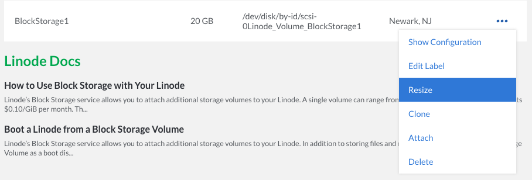
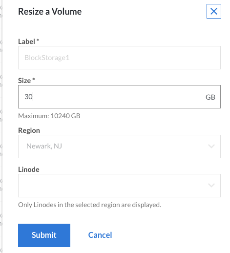

---
author:
  name: Linode
  email: docs@linode.com
description: 'Shortguide that describes how to resize your Block Storage Volume to make it smaller.'
license: '[CC BY-ND 4.0](https://creativecommons.org/licenses/by-nd/4.0)'
modified: 2020-07-20
modified_by:
  name: Heather Zoppetti
published: 2020-07-20
title: Resize a Block Storage Volume
keywords: ["block storage"]
headless: true
show_on_rss_feed: false
tags: ["linode platform"]
---

Storage Volumes **cannot** be sized down, only up. Keep this in mind when sizing your Volumes.

1.  Shut down your Linode.

1.  Click the **more options ellipsis** next to the Volume you would like to resize to bring up the Volume's menu.

1.  Click **Resize**.

    

1.  Enter the new Volume size. The minimum size is 10 GiB and maximum is 10,000 GiB. Then click **Submit**.

    

1.  You'll be returned to the Volume list and the notification bell in the top right of the page will notify you when the resizing is complete.

    

1.  Reboot your Linode.

1.  Once your Linode has restarted, make sure the Volume is unmounted for safety:

        umount /dev/disk/by-id/scsi-0Linode_Volume_BlockStorage1

1.  Assuming you have an ext2, ext3, or ext4 partition,first run a file system check:

        e2fsck -f /dev/disk/by-id/scsi-0Linode_Volume_BlockStorage1

1.  Then resize it to fill the new Volume size:

        resize2fs /dev/disk/by-id/scsi-0Linode_Volume_BlockStorage1

1.  Mount your volume back onto the filesystem:

        mount /dev/disk/by-id/scsi-0Linode_Volume_BlockStorage1 /mnt/BlockStorage1
