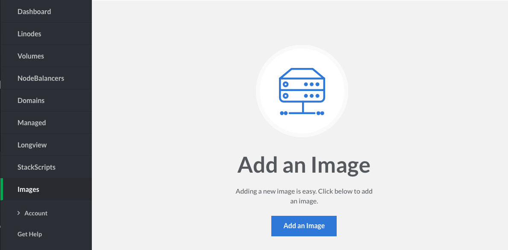

---
author:
  name: Linode
  email: docs@linode.com
description: 'Shortguide that shows you how capture an image with Linode Images.'
license: '[CC BY-ND 4.0](https://creativecommons.org/licenses/by-nd/4.0)'
modified: 2020-07-20
modified_by:
  name: Heather Zoppetti
published: 2020-07-20
title: How to Capture a Linode Disk Image
keywords: ["images"]
headless: true
show_on_rss_feed: false
tags: ["linode platform"]
---

Linode Images captures an exact copy of your disk at the moment when the process is kicked off. Here's how to capture your first image.


While an image can be captured while your Linode is running, we would recommend shutting your Linode down first if you are running any active databases. Capturing an image that includes a running database can cause corruption or data loss in the imaged copy of the database.


1.  Navigate to your the Images page in the Linode Cloud Manager and select **Add an Image**.

    

1.  In the **Create an Image** menu select the Linode and disk you would like to freeze, and provide a label. You may also add an optional description of the image. Then, click **Create**.

    

    
CoreOS disk images are in RAW format. Images made from CoreOS disks will not be able to be used to deploy new Linodes.


1.  Once you click the **Create** button, your image will be frozen for later use. You can view the progress under the bell notifications at the top of the page.

    

    
Linode Images are limited to 6144MB of data per disk.  You will need to ensure that data within your disk does not exceed this size limit. Additionally, Linode Images cannot be created if you are using raw disks or disks that have been formatted using custom filesystems. Additionally, the Image will be the smallest possible size based on the data present on the disk rather than the full Disk Allocation. 

    Once the job has completed, your Linode's disk has been captured and stored.
