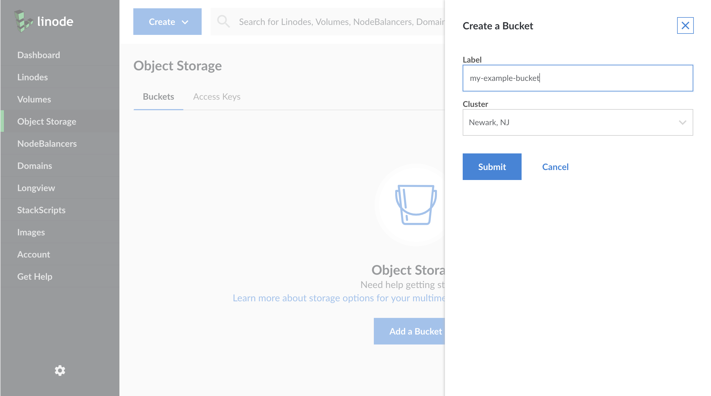

---
author:
  name: Linode
  email: docs@linode.com
description: 'Shortguide that shows you how to create a Linode Object Storage bucket.'
license: '[CC BY-ND 4.0](https://creativecommons.org/licenses/by-nd/4.0)'
modified: 2020-07-22
modified_by:
  name: Heather Zoppetti
published: 2020-07-22
title: How to Create a Linode Object Storage Bucket
keywords: ["object storage"]
headless: true
show_on_rss_feed: false
tags: ["linode platform"]
---

The Cloud Manager provides a web interface for creating buckets. To create a bucket:

1.  If you have not already, log into the [Linode Cloud Manager](https://cloud.linode.com).

1.  Click the **Object Storage** link in the sidebar, and then click **Add a Bucket**.

    

    If you have not created an access key or a bucket before, you are prompted to enable Object Storage.

1.  The **Create a Bucket** menu appears.

    

1.  Add a label for the bucket. See the [Bucket Name](/docs/platform/object-storage/how-to-use-object-storage/#bucket-names) section for rules on naming the bucket.

1.  Choose a cluster location for the bucket to reside in.

    

1.  Click **Submit**. You are now ready to [upload objects to the bucket](/docs/platform/object-storage/how-to-use-object-storage/#upload-objects-to-a-bucket).
